= Elektronische Scheinprüfung - Softwareentwicklung I
:icons: font
Prof. Dr. Ullrich Hafner <ullrich.hafner@hm.edu>
:toc-title: Inhaltsverzeichnis
:chapter-label:
:chapter-refsig: Kapitel
:section-label: Abschnitt
:section-refsig: Abschnitt

:xrefstyle: short
:!sectnums:
:partnums:
ifndef::includedir[:includedir: ./]
ifndef::imagesdir[:imagesdir: ./]
ifndef::plantUMLDir[:plantUMLDir: .plantuml/]
:figure-caption: Abbildung
:table-caption: Tabelle

ifdef::env-github[]
:tip-caption: :bulb:
:note-caption: :information_source:
:important-caption: :heavy_exclamation_mark:
:caution-caption: :fire:
:warning-caption: :warning:
endif::[]

[hinweise]
== Allgemeine Hinweise bzw. Tipps

[TIP]
====

Das Live Programming findet mit den eigenen Laptops am 16. Dezember von 11:45-13:15 in den Räumen R1.007 und R.1008 statt. In beiden Räumen wird jeweils ein Professor die Aufsicht übernehmen, sodass ich zwischen diesen beiden Räumen hin und her laufen kann, um Fragen zu beantworten. Die Raumaufteilung erfolgt vor dem Start, seien Sie daher bitte pünktlich. Elektronische Hilfsmittel sind neben dem eigenen Rechner keine erlaubt (keine Handys und Tablets). Denken Sie an ein Ladegerät für Laptop bzw. an ausreichend aufgeladene Batterien. Während der Prüfung werde ich die Ausweise von allen teilnehmenden Personen prüfen, halten Sie dazu bitte einen Lichtbildausweis und Ihren Studierendenausweis bereit.

Laden Sie Ihre Lösung erst am Ende der Prüfung in den https://classroom.github.com/TODO[GitHub Classroom Kara Schein] auf den eigenen `main` Branch hoch. Wenn beim Erstellen des GitHub Classrooms ein Fehler auftritt, können Sie die Aufgabenstellung und das Ausgangsprojekt auch aus Moodle herunterladen. Wenn beim abschließendem Hochladen ein Fehler auftritt, warten Sie bitte, bis ich oder ein betreuender Professor an Ihren Platz kommt, um das Hochladen gemeinsam durchzuführen. Verlassen Sie nicht den Raum, bevor Ihre Lösung auch sicher in GitHub angekommen ist.

Es gibt insgesamt 3 Aufgaben, die möglicherweise in kleinere Teilaufgaben gesplittet sind, damit Sie leichter sehen, dass Sie bereits Teilschritte erfolgreich gelöst haben. Jede der drei Aufgaben wird mit 20 Punkten bewertet. Wenn Sie bei einer Aufgabe hängen, machen Sie mit der nächsten Aufgabe weiter und kommen Sie später zurück. Verteilen Sie die Arbeitszeit von 90 Minuten in etwa gleich auf die 3 Aufgaben.

Wie bereits angekündigt, ist auch ein guter Programmierstil wichtig, daher können Sie jeweils bis zu 2 Punkte pro Aufgabe verlieren (10%), wenn Sie sich nicht an den Codingstyle von mir halten. Für diese Prüfung sind nur die Resultate aus der CheckStyle Analyse relevant, die Sie auch in IntelliJ sehen können (1 Minuspunkt pro 5 Warnungen). Ein automatisches Prüfen der Lösungen über die GitHub Funktionalität (Autograding) steht Ihnen während der Prüfung nicht zur Verfügung.

Zum sicheren Bestehen der Prüfung reicht es, 40 von 60 Punkten zu erreichen. Sollten Sie die Prüfung nicht bestehen, oder an dem Prüfungstag krank sein (ärztliches Attest erforderlich), erhalten Sie am 13.1.2023 eine weitere Möglichkeit, den Schein zu erwerben.

Die Aufgaben müssen alleine und ohne fremde Hilfe gelöst werden. Sie dürfen zur Bearbeitung die Vorlesungsunterlagen zurate ziehen und auch Internetquellen aufrufen. Chats, Mails und andere Kommunikationsmittel sind nicht erlaubt. Beachten Sie, dass Sie keine Quelltexte aus fremden Quellen in Ihre Arbeit integrieren dürfen, das wäre sonst ein Plagiat. Alle Lösungen werden zudem nach der Prüfung in ein Plagiat-Prüfprogramm eingespielt: sollten dabei Duplikate entdeckt werden, werden die Arbeiten aller Beteiligten (also auch die Person, die das Original verfasst hat) mit einer 5 benotet. Eine Teilnahme an der Wiederholungsprüfung ist in diesem Fall nicht möglich.

Beachten Sie wieder, dass in allen Aufgaben beliebige Welten (gemäß der Aufgabenstellung) zulässig sind. D.h. eine Aufgabe ist nur teilweise gelöst, wenn Ihr Programm nur für einige der abgebildeten Varianten funktioniert. Die vorhandenen Tests prüfen einige der möglichen Szenarien, sind also ein guter Indikator, wie gut Ihre Lösung ist. Achtung: die Testergebnisse lassen sich aber nicht direkt in Punkte umrechnen. Manche Tests sind jetzt schon grün, auch wenn Sie noch gar nicht begonnen haben. Diese Tests müssen abschließend immer noch grün bleiben. Bei meiner Korrektur im Nachgang können außerdem zusätzliche Tests zum Einsatz kommen, um die korrekte Lösung zu bewerten. Für alle Tests gilt: entscheidend für den Erfolg eines Tests ist die korrekte Darstellung der erwarteten Welt. Die Position von Kara ist nicht relevant.

Die Voraussetzungen sind auch wie bisher für alle Aufgaben: Instanzvariablen, Container und Utility Methoden aus `java.util` sind **nicht erlaubt**. Nur lokale Variablen (und ggf. Methodenparameter) sind zur Speicherung von Werten und Arrays erlaubt. Zweidimensionale Arrays dürfen verwendet werden, bringen bei den Aufgaben allerdings keinen Mehrwert.

====

== 1. Malen von Vierecken (Thema: Schleifen und einfache Logik)

Damit der Start leichter fällt, ist die erste Aufgabe in zwei Teilschritte aufgeteilt. Sie können wahlweise mit Aufgabe 1a starten und dann den Code so verbessern, dass er auch Aufgabe 1b erfüllt. Wenn Sie sich fit genug fühlen, können Sie aber auch gleich zur Aufgabe 1b übergeben, und die generelle Lösung des Problems angehen.

=== 1a. Malen von Quadranten

Schreiben Sie ein Programm für Kara, das eine leere quadratische Welt in vier gleich große Quadranten unterteilt. Damit das Teilen ohne Rest funktioniert, sind Breite und Höhe jeder Welt immer eine gerade Zahl, also 2x2, 4x4, 6x6, etc.

.Ausgangssituation XS (links) und erwartetes Ergebnis (rechts)
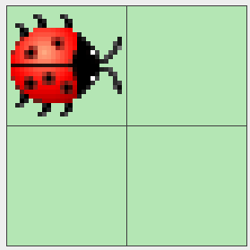
image:images/right-arrow.png[width=10%, pdfwidth=10%]
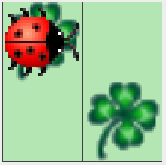

.Ausgangssituation S (links) und erwartetes Ergebnis (rechts)
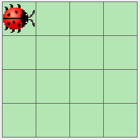
image:images/right-arrow.png[width=10%, pdfwidth=10%]
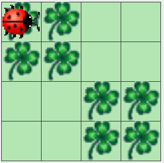

.Ausgangssituation L (links) und erwartetes Ergebnis (rechts)
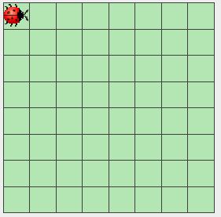
image:images/right-arrow.png[width=10%, pdfwidth=10%]
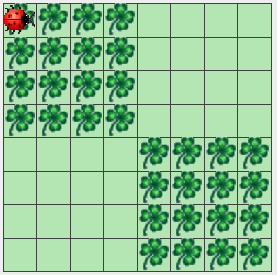

=== 1b. Malen von Rechtecken

Schreiben Sie ein Programm für Kara, das in eine leere quadratische Welt zwei ausgemalte Rechtecke malt. Das erste Rechteck startet in der linken oberen Ecke und ist so viele Blätter breit und hoch, wie beim Start des Programms als Parameter eingegeben. Das zweite Rechteck startet direkt im Anschluss danach.

.Ausgangssituation L (links) und erwartetes Ergebnis (rechts) bei Eingabe Breite = 2 und Höhe = 6
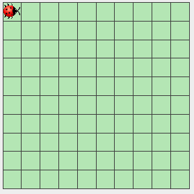
image:images/right-arrow.png[width=10%, pdfwidth=10%]
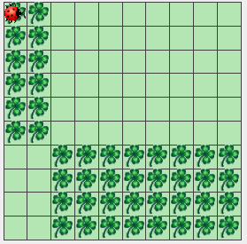

.Ausgangssituation L (links) und erwartetes Ergebnis (rechts) bei Eingabe Breite = 7 und Höhe = 1

image:images/right-arrow.png[width=10%, pdfwidth=10%]
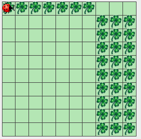

== 2. Zerlegen von Dezimalzahlen (Thema: Schleifen und Rechnen)

Kara soll nicht negative Dezimalzahlen im Bereit 0-999999 in Karas Welt zeichnen. Es gibt nur eine Welt in diese Aufgabe: Die Welt ist komplett leer und hat eine Breite von 6 (für jede Dezimalstelle eine Spalte) und eine Höhe von 9 (für die Darstellung der Ziffern 0 bis 9). Jede Dezimalstelle der jeweils einzugebenden Zahl muss in eine Spalte mit 0 bis 9 Blättern dargestellt werden. Das Auftragen der Blätter startet von unten, Lücken sind nicht erlaubt. Ganz links ist die höherwertigste Dezimalstelle, ganz rechts die niederwertigste angeordnet. Nicht benötigte Dezimalstellen bleiben leer. Stellen Sie außerdem sicher, dass bei einer Eingabe von Zahlen > 999999 oder < 0 nichts gemalt wird.

Beispiele:

- die Zahl 0 lässt die Welt unverändert, wird also mit 0, 0, 0, 0, 0, 0 Blättern dargestellt. D.h. die Welt bleibt leer.
- Die Zahl 123 wird durch 0, 0, 0, 1, 2, 3 Blättern dargestellt. Die ersten drei Spalten bleiben daher leer.
- Die Zahl 21212 wird durch 0, 2, 1, 2, 1, 2 Blättern dargestellt. Die erste Spalte bleibt daher leer.
- Die Zahl 987654 wird durch 9, 8, 7, 6, 5, 4 Blättern dargestellt.

.Die Zahlen 0, 123, 21212 und 987654 aufgemalt in Karas Welt
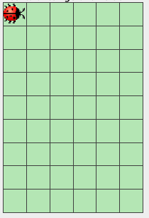
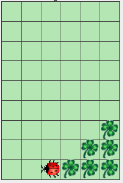
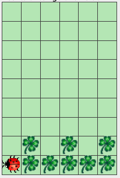
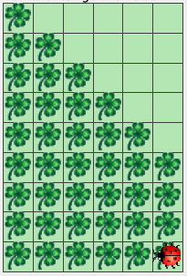

== 3. Finden von Mustern (Thema: Arrays)

Kara soll ein Muster aus Blättern in einer Zeile der vorgegebenen Welt finden. Die Welt ist dabei wie folgt aufgebaut: Sie ist immer gleich hoch, aber beliebig breit. Die gesamte Welt ist mit Bäumen umrandet. Das zu suchenden Muster ist in der obersten begehbaren Zeile der Welt aufgetragen. Die unterste begehbare Zeile enthält dann den Ausschnitt, in dem nach dem Muster gesucht werden soll. Die Länge des zu suchenden Musters wird durch Pilze links und rechts daneben eingegrenzt. Ebenso der Bereich, in dem das Muster gesucht werden soll. Kara selbst steht in der Mitte zwischen diesen beiden Zeilen. Die mittlere Zeile ist sonst mit Bäumen gefüllt, um die obere von der unteren Zeile visuell zu trennen.

Beispiele:

.In diesen Welten wird das Muster (Orange) jeweils in der unteren Zeile gefunden (grün)
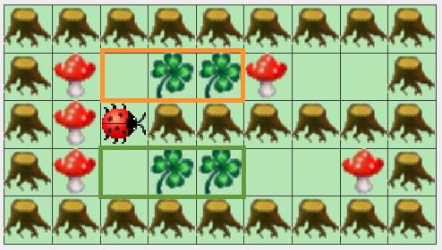
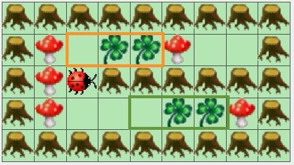

.In diesen Welten wird das Muster (Orange) nicht gefunden
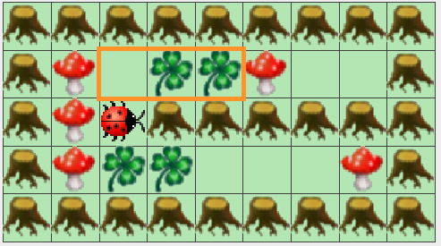
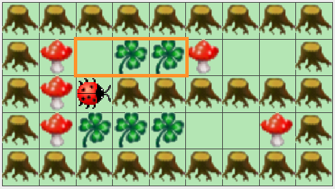

.In dieser langen Welt wird das Muster (Orange) auch in der unteren Zeile gefunden (grün)
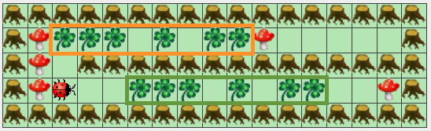

Hinweis: Wenn Sie es nicht schaffen, beliebig breite Welten zu unterstützen, können Sie auch mit der festen Weltgröße aus den vier oberen Beispielen zu arbeiten. Damit erhalten Sie zumindest einen Teil der Punkte.

